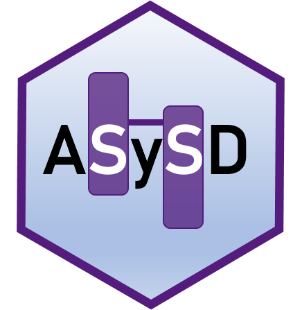

```{=html}
<style>
.list-group-item.active, .list-group-item.active:focus, .list-group-item.active:hover {
    background-color: #754E9B;
}
</style>
```
## Overview



Welcome to the the **Automated Systematic Search Deduplicator** app! This free tool allows you to upload a file containing citation data and remove duplicate citations using a combination of automated and manual methods. Following deduplication, you can export your unique citations. You can find out more about ASySD by going to the *About* page!

ASySD uses the following metadata to identify duplicates:

| **Name**              | **Definition**                                                                                                                         |
|:----------------------|:---------------------------------------------------------------------------------------------------------------------------------------|
| **author**            | The author(s) of the publication                                                                                                       |
| **year**              | The year the publication was published                                                                                                 |
| **journal**           | The name of the journal in which the publication appeared                                                                              |
| **doi**               | The Digital Object Identifier (DOI) assigned to the publication                                                                        |
| **title**             | The title of the publication                                                                                                           |
| **pages**             | The page numbers of the publication                                                                                                    |
| **volume**            | The volume number of the publication (if applicable)                                                                                   |
| **number**            | The issue number of the publication (if applicable)                                                                                    |
| **abstract**          | Abstract of publication                                                                                                                |
| **record_id**         | A unique identifier for the publication. If this is not obtained from the citation file, ASySD will genereate an id for each citation. |
| **isbn**              | The International Standard Book Number (ISBN) assigned to the publication (if applicable)                                              |
| **label (optional)**  | A label or tag assigned to the publication (if applicable) - for example, **new search** or **old search**                             |
| **source (optional)** | The source or database from which the publication was obtained - for example **wos**, **embase**, **pubmed**, **scopus**               |

## Uploading citations

1.  Navigate to the *Upload* page

2.  Choose a file format

3.  Click browse and locate one or more files to upload (in the same format)

4.  Once upload is complete, you can preview the citations in the table to the right

5.  Go to the *Check Metadata* tab to evaluate missing metadata across different fields - note that the performance of ASySD may vary significantly if key metadata such as pages and DOIs are not present in the citations

6.  If you want to assign a label or source to individual files, you can do so by going to the *add labels/sources* tab

    [Note]{.underline}: we recommend using the **Endnote generated XML** upload format where possible as this has undergone the most user testing. Note that this export format should be possible from Endnote, Zotero, and Mendeley.

## Automated Deduplication

1.  Navigate to the *Deduplicate* page

2.  Adjust the auto-deduplication options

3.  Click the *Remove duplicates* button to start automated deduplication

4.  Once complete, results will be shown on the right

### Citation to keep

ASySD identifies groups of duplicate citations. Within each set, one citation will be retained with merged meta-data. For example, if one citation within the group had a DOI, this DOI will be retained in the final unique citation.

If you uploaded citations with a unique record_id, one of these will be chosen as the duplicate_id for each group of duplicates. If you select a certain preference here, this record_id will be chosen over others.

If you have no preference, please leave this at the default option.

## Manual Deduplication

1.  Within the *Deduplicate* page, navigate to the *Manual deduplication* tab

2.  Depending on the number of potential duplicates identified, you may want to manually review them via the app, or flag them for later review in a reference manager or other software.

### Removing in app

-   Pairs of citations which require manual deduplication are shown in a table.

-   Click all the rows of duplicate pairs (this will highlight each selected row in blue). Once you have selected all duplicate pairs, press the *remove duplicates* button and wait for confirmation that duplicates have been removed

Note that often, the same citation will be present in more than one pair.

| Record1 | Record2 |
|:--------|:--------|
| 1111    | 1222    |
| 3422    | 1111    |
| 1111    | 6523    |
| 3422    | 6523    |
| 1222    | 3422    |

For example, you may class all 5 rows above as duplicates. ASySD will retain one of these citations and remove the rest. In this case, 4 citations would be removed (rather than 5).

The the pairs you deem as true duplicates will be passed to the ASySD algorithm and the citations will go through the entire deduplication process again. This is to avoid erroneous removal of citations and to ensure that only one unique citation is retained for each group of duplicates.

### Flagging for review

If you prefer to flag for later review, click specific rows and click the *flag selected pairs* button, or alternatively click *flag all pairs* to flag every possible duplicate pair.

Within Zotero or Endnote, you can identify citations with a flag and go through them manually to check for more duplicates. For details on how this is shown in different reference managers, please read the formatting information on the *Download* page.

## Downloading citations

-   After deduplication is complete, you can navigate to the *Download* page to export your citations
-   You can either export **all citations** or only the **unique citations**

### Exporting sources and labels

If we have citations from three sources, our export file will look something like this:

| duplicate_id | title                                                        | source              |
|:-------------|:-------------------------------------------------------------|:--------------------|
| 111          | *An example article*                                         | wos, pubmed         |
| 112          | *Another example which was only in wos*                      | wos                 |
| 113          | *Yet another example which was only in pubmed*               | pubmed              |
| 114          | *Another example paper which was present across all sources* | pubmed, wos, scopus |

As you can see, when a citation was present across multiple sources this is indicated in the source output. This is because of the way ASySD merges duplicate citations together.

### Exporting all citations

ASySD gives users the option to check the duplicate groups it has generated. All citations with the same duplicate_id are in one group. By exporting all citations into Endnote or Zotero, you can see the duplicate_id field and can check within any of the groups.

### Advanced customisation

There is also an option to customise the download with more advanced options such as only including citations with specific labels or sources. By default, all sources and labels will be listed here so the export will include everything.

#### Citations with these labels will be exported

You can specify that ASySD should retain only specific citations that contain a certain label or source. In the example above, retaining citations with **wos** as the source would retain all citations where **wos** was present in the source column (i.e. duplicate_id 111, 112, and 114)

#### Only retain citations which are unique to this label

Turn on this switch if you want to retain citations which only have the specified source/label in the field. In the example above, if you switched this setting on for **wos**, the export would contain only those citations with wos and no other source (i.e. duplicate_id 112)

## ASySD video tutorials

We recently presented ASySD at ESMARConf 2023! Please check out the ASySD [Tutorial on YouTube](https://www.youtube.com/watch?v=oCR1A_heFcs).

```{r setup,  echo=FALSE}
knitr::include_url("https://www.youtube.com/embed/oCR1A_heFcs")

```

The team at Biblioteca de Ciencias de la Salud de la Universidad de Oviedo have produced a Spanish language ASySD tutorial available [here](https://view.genially.com/6612f573192f0b0014510b9f)

The team at evidence.ir have produced a Persian language ASySD tutorial available [here](https://evidence.ir/%d8%ad%d8%b0%d9%81-%d8%b1%da%a9%d9%88%d8%b1%d8%af%d9%87%d8%a7%db%8c-%d8%aa%da%a9%d8%b1%d8%a7%d8%b1%db%8c-%d8%a8%d8%a7-asysd/)
